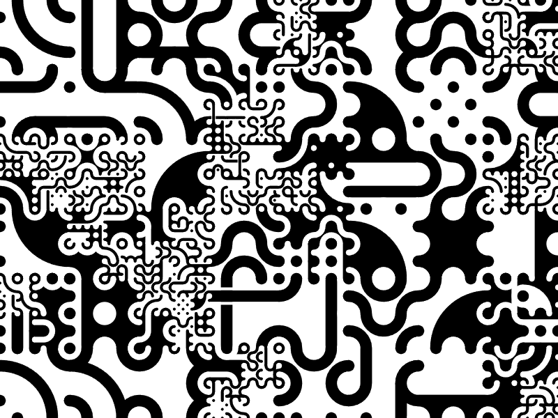

# Truchet Viewer

A Python library for generating and exploring multi-scale Truchet tile patterns using [PyCairo](https://pycairo.readthedocs.io/en/latest/)
and [Streamlit](https://docs.streamlit.io/).
This library provides tools for creating complex, visually appealing patterns through both interactive Jupyter notebooks and a web-based app.


## Features

- Generate multi-scale Truchet tile patterns with customizable depth and complexity
- Rich set of predefined tile patterns including circles, lattices, and filled shapes
- Interactive exploration through Jupyter notebooks and Streamlit app
- Flexible Cairo-based rendering supporting SVG and PNG output

## Installation

### Prerequisites

The package requires Python 3.12 or later and depends on PyCairo. On some systems, you may need to install Cairo development headers:

```bash
# Ubuntu/Debian
sudo apt-get install libcairo2-dev pkg-config python3-dev

# macOS
brew install cmake pkgconf cairo

# Windows
# Install Cairo through MSYS2 or use the wheels available on PyPI
```

### Installing from PyPI

```bash
pip install truchet-viewer
```

### Installing from Source

Clone the repository and install in development mode:

```bash
git clone https://github.com/jobar8/truchet-viewer.git
cd truchet-viewer
pip install -e .
```

For development dependencies (linting, testing):

```bash
pip install -e ".[dev]"
```

## Quick Start

```python
from truchet_viewer import multiscale_truchet, show_tiles
from truchet_viewer.n6 import n6_tiles

# Display available tiles
show_tiles(n6_tiles, with_value=True, with_name=True)

# Generate a multi-scale pattern
multiscale_truchet(
    tiles=n6_tiles,
    width=800,
    height=600,
    tilew=100,
    nlayers=3,
    chance=0.45
)
```

This will create a multi-scale Truchet pattern using the N6 tile set. It should look something like this:



## Examples

Check out the example notebooks in the `examples/` directory:
- `Truchet.ipynb` - Basic usage and pattern generation
- `N6.ipynb` - Exploring different tile types

## Acknowledgments

This project implements [Christopher Carlson][carlson]'s work on multi-scale Truchet tiles. The original inspiration came
from a [blog post](https://nedbatchelder.com/blog/202208/truchet_images.html) by Ned Batchelder, who implemented
[the first version](https://github.com/nedbat/truchet) using PIL and PyCairo.

## License

This code is Apache licensed. See LICENSE for details.

[carlson]: https://christophercarlson.com/portfolio/multi-scale-truchet-patterns